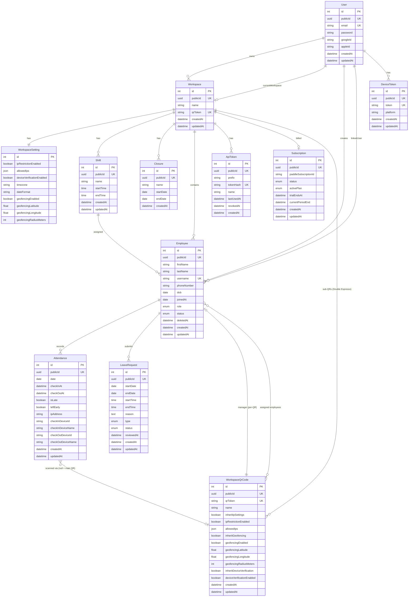
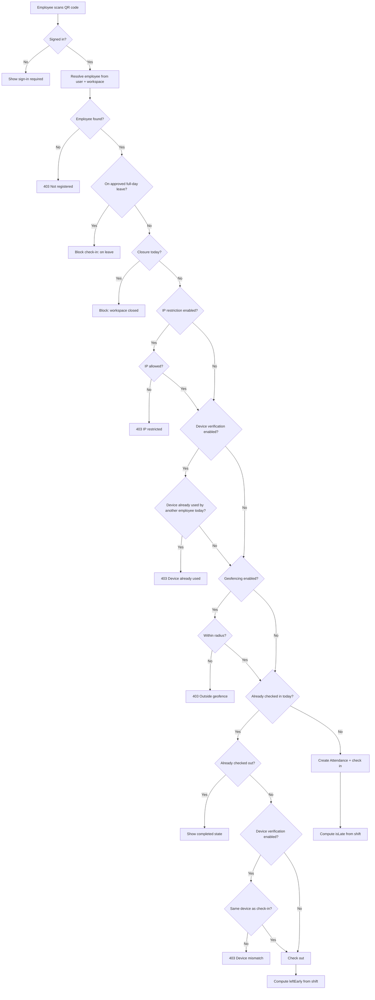
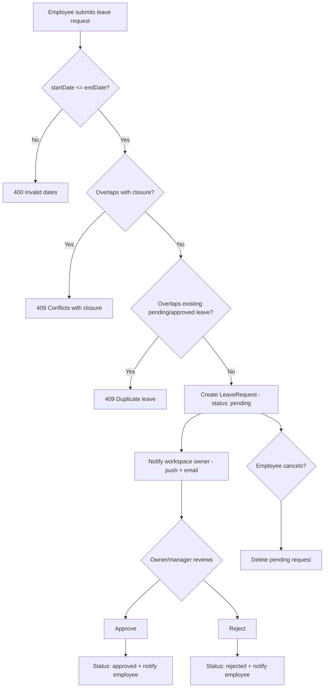
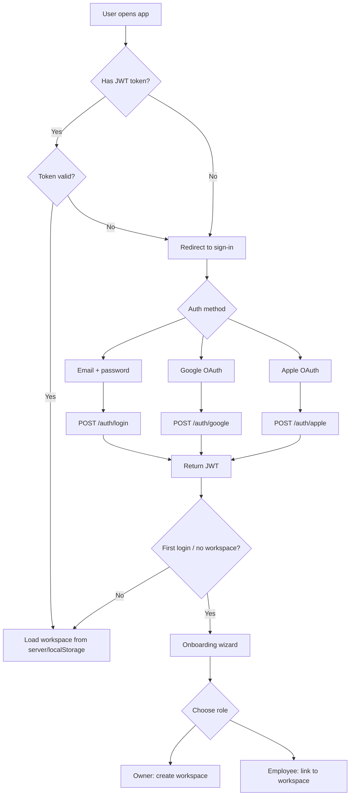

# Architecture

DailyBrew is multi-tenant: **Workspace** is the root aggregate, and every domain entity (Employee, Shift, Closure, LeaveRequest, Attendance, ApiToken, WorkspaceQrCode) belongs to exactly one Workspace. Cross-workspace access is impossible by construction — there are no APIs that list entities across workspaces, and every workspace-scoped controller routes through `App\Security\WorkspaceVoter` (`VIEW`, `MANAGE`, `EDIT`, `DELETE` attributes). `MANAGE` covers owner + manager actions like approving leave; `EDIT`/`DELETE` are owner-only.

Use the diagrams below to navigate the entity model and the three primary user flows (check-in, leave request, authentication).

## Project Structure

```
src/
  ApiController/          # API controllers
    Auth/                 # Login, register, OAuth
    Workspace/            # Workspace CRUD, settings, dashboard, API tokens
    Employee/             # Employee CRUD
    Shift/                # Shift CRUD
    Closure/              # Closure CRUD
    Attendance/           # Attendance log
    LeaveRequest/         # Leave request management
    Checkin/              # QR check-in endpoint (auth required)
    Device/               # Push notification device token registration
    BasilBook/            # External API for BasilBook integration
    Paddle/               # Paddle webhook handler
    Plan/                 # Plan/subscription info
    Dev/                  # Dev-only endpoints (plan toggle)
  Entity/                 # Doctrine entities
  Repository/             # Doctrine repositories
  Service/                # Business logic
  Security/               # WorkspaceVoter, BasilBookApiKeyAuthenticator
  Enum/                   # Plan, LeaveRequestStatus, SubscriptionStatus
  EventSubscriber/        # Exception handling, rate limiting

assets/src/
  routes/                 # TanStack Router file-based routes
  components/
    dashboard/            # OwnerDashboard, EmployeeDashboard
    layout/               # Sidebar, WorkspaceSwitcher, PageHeader
    shared/               # GlassCard, CustomSelect, CustomDatePicker, etc.
    landing/              # Landing page sections
  hooks/
    queries/              # TanStack Query hooks (useWorkspaces, usePlan, etc.)
  lib/                    # API client (apiAxios), auth, utils (cn)
  types/                  # TypeScript interfaces
  i18n/                   # Translation files (en, fr, km)
```

## Entity-Relationship Model



## Flow Diagrams

### QR Check-in Flow



### Leave Request Flow



### Sub-QR check-in (Double Espresso)

On Double Espresso, a workspace can mint additional `WorkspaceQrCode` rows ("sub-QRs") on top of its main `qrToken`. The mobile scanner routes by URL prefix:

- `dailybrew:ws:{token}` → main QR → `POST /api/v1/checkin/{token}` → settings come from `WorkspaceSetting`.
- `dailybrew:wqr:{token}` → sub-QR → `POST /api/v1/checkin/qr/{token}` → settings come from `WorkspaceQrCode` via `App\Service\Checkin\EffectiveCheckinSettings::fromQrCode()`.

`EffectiveCheckinSettings` resolves three independent clusters — IP restriction, geofencing, device verification — by reading the sub-QR's `inherit{Ip,Geofencing,DeviceVerification}` flags. When inherited, the value is read from the parent `WorkspaceSetting`; otherwise the sub-QR's own override fields are used. **Timezone is always inherited from the workspace** — sub-QRs cannot override it. The result is passed into the same `CheckinService::checkin()` call used by the main flow, so the gate order (closure → leave → IP → device → geofence → attendance) is identical.

Sub-QRs also carry an optional `manager` (an Employee with a linked user) and an `assignedEmployees` set. If the set is non-empty, the backend rejects (`403`) any employee not in it. The per-QR manager has VIEW + leave-approval rights only over the assigned employees; they cannot edit shifts, closures, settings, or the QR itself — those remain owner-only.

When an attendance row is created via a sub-QR, its `qrCode` FK is set; main-QR check-ins leave it null. The relationship is `ON DELETE SET NULL` so deleting a sub-QR retains the historical attendance audit. Per-QR manager FKs are also `ON DELETE SET NULL`.

### Authentication Flow



## Plans & Feature Gating

Three subscription tiers — `Free`, `Espresso`, `DoubleEspresso` — are encoded in `App\Enum\PlanEnum`. The currently active plan is derived from the workspace's Paddle `Subscription`: `null` subscription → `Free`; otherwise `Subscription::getActivePlan()` returns the stored plan only when the subscription `isActive()` (status `active` or `trialing`), and falls back to `Free` for `canceled`, `paused`, and `past_due`. There is no per-feature flag table — the source of truth is `App\Service\PlanService`.

`PlanService` is the single entry point for every gate the app enforces. It exposes:

- **Capability checks** — `canUseIpRestriction()`, `canUseGeofencing()`, `canUseLeaveRequests()`, `canUseShiftTimeRules()`, `canUseDeviceVerification()`, `canUseManagers()`, `canUseTelegramNotifications()`, `canUseSubQrCodes()`. Espresso unlocks the first seven; Double Espresso adds sub-QRs.
- **Quota checks** — `canAddEmployee()`, `canPromoteToManager()`, `getRemainingEmployeeSlots()`, `getEmployeeLimit()`, `getManagerLimit()`. Limits are class constants: `FREE_EMPLOYEE_LIMIT = 10`, `ESPRESSO_EMPLOYEE_LIMIT = 20`, `ESPRESSO_MANAGER_LIMIT = 2`. Double Espresso returns `null` for both limits to signal unlimited.
- **DTO assembly** — `getPlanDetails()` returns the JSON payload behind `GET /api/v1/{locale}/workspaces/{publicId}/plan`. The frontend reads it via `usePlan()` and uses the boolean capabilities to gate UI (toggles render OFF when not supported, manager-promotion buttons disable when the limit is reached).

Backend enforcement happens at two layers:
1. **Controller** — `PlanService` is called before mutating an entity (e.g. employee creation rejects when `canAddEmployee()` is false).
2. **Service** — services that emit notifications or expose external APIs (BasilBook pull, leave notifications, daily summary) check `isAtLeastEspresso()` themselves so they can't be bypassed by a stale UI.

Plan downgrades are handled in `PaddleWebhookService`. When `subscription.canceled` / `paused` / `past_due` arrives, the handlers only flip `Subscription::status` — they don't delete employees, managers, or sub-QRs. The next `canAddEmployee()` / `canPromoteToManager()` call simply returns `false` (because `getActivePlan()` now returns `Free`), so existing records remain visible until the owner upgrades or removes them. Workspace deletion is the inverse: `WorkspaceService::delete()` proactively cancels the active Paddle subscription via API before soft-deleting locally, swallowing API failures so a Paddle outage can't block the local delete.
