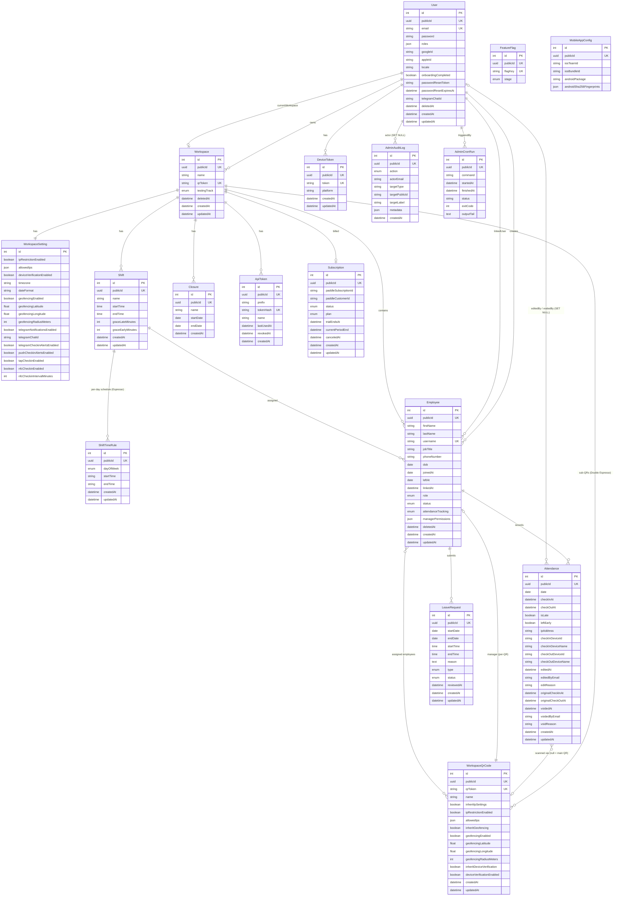
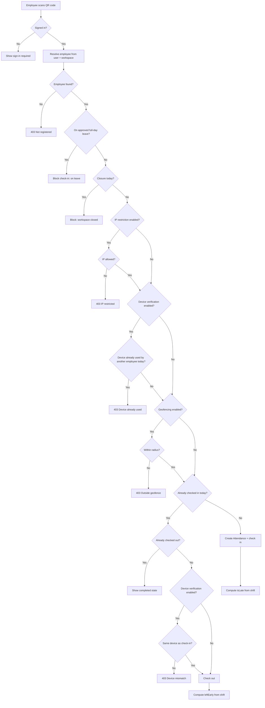
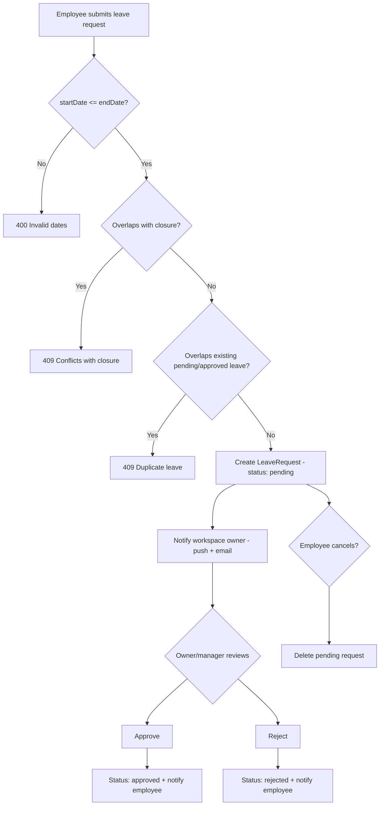
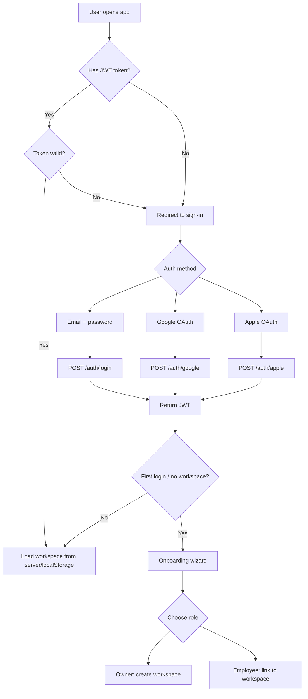

# Architecture

DailyBrew is multi-tenant: **Workspace** is the root aggregate, and every domain entity (Employee, Shift, ShiftTimeRule, Closure, LeaveRequest, Attendance, ApiToken, WorkspaceQrCode) belongs to exactly one Workspace. Cross-workspace access is impossible by construction — there are no APIs that list entities across workspaces, and every workspace-scoped controller routes through `App\Security\WorkspaceVoter`. The one deliberate exception is the platform admin console (`/admin/*`), which sits outside tenancy entirely and is gated by `ROLE_SUPER_ADMIN` instead — see [Platform admin & audit trail](#platform-admin--audit-trail).

The voter exposes these families of attributes:

- `VIEW` — any member of the workspace (owner, manager, or linked employee).
- `MANAGE` — owner + any manager. **Legacy/role-based**, kept for read-only or generic gates; new code should prefer the capability attributes below.
- Capability attributes — `MANAGE_EMPLOYEES`, `MANAGE_SHIFTS`, `MANAGE_CLOSURES`, `MANAGE_LEAVE_REQUESTS`, `MANAGE_ATTENDANCES`. Each maps 1:1 to a `ManagerPermissionEnum` value (`manage_employees`, `manage_shifts`, `manage_closures`, `manage_leave`, `manage_attendance`) stored on `Employee.managerPermissions` (JSON array). Owners are granted everything implicitly.
- `EDIT` / `DELETE` — on a typed entity (`Employee`, `Shift`, `ClosurePeriod`, `Attendance`, `LeaveRequest`) they resolve to the matching capability. On a `Workspace` subject they remain owner-only (rename, settings, billing, deletion).

Use the diagrams below to navigate the entity model and the three primary user flows (check-in, leave request, authentication).

## Project Structure

```
src/
  ApiController/          # API controllers
    Auth/                 # Login, register, OAuth, password reset
    User/                 # /users/me — profile, links, OAuth + Telegram connections, avatar
    Profile/              # Browser OAuth connect/disconnect round-trip
    Workspace/            # Workspace CRUD, settings, dashboard + trends, logo, sub-QR codes, API tokens
    Employee/             # Employee CRUD, manager permissions, photo
    Shift/                # Shift CRUD + per-day time rules
    Closure/              # Closure CRUD
    Attendance/           # Attendance log, summary, manual entry / override / void, exports
    LeaveRequest/         # Leave request management
    Checkin/              # QR check-in endpoint (auth required)
    Device/               # Push notification device token registration
    Admin/                # Platform admin (ROLE_SUPER_ADMIN): dashboard, workspaces,
                          # users, subscriptions, churn, audit log, feature flags,
                          # mobile app config, cron scheduler
    Support/              # SupportDock feedback proxy + Mailgun inbound
    Telegram/             # Telegram bot webhook
    BasilBook/            # External API for BasilBook integration
    Paddle/               # Paddle webhook handler
    Plan/                 # Plan/subscription info
    Dev/                  # Dev-only endpoints (plan toggle)
  Controller/             # Non-API: SPA shell, SEO (sitemap), /.well-known
  Entity/                 # Doctrine entities
  Repository/             # Doctrine repositories
  Service/                # Business logic
    Attendance/           # Flag calculation, row building, exports
    Checkin/              # EffectiveCheckinSettings (main-QR vs sub-QR resolution)
    Cron/                 # CronJobRegistry allowlist + run recording
    Dashboard/            # Trend tallies behind the dashboard charts
    Image/                # Avatar/logo/photo processing
    Seo/                  # Server-rendered meta resolution
  Security/               # WorkspaceVoter, BasilBookApiKeyAuthenticator
  Enum/                   # Plan, ManagerPermission, FeatureFlagStage, WorkspaceTestingTrack, …
  EventSubscriber/        # Exception handling, rate limiting

assets/src/               # Legacy SPA (React 19 + Webpack Encore) — still the default frontend
  routes/                 # TanStack Router file-based routes
  components/
    dashboard/            # OwnerDashboard, EmployeeDashboard
    layout/               # Sidebar, WorkspaceSwitcher, PageHeader
    shared/               # GlassCard, CustomSelect, CustomDatePicker, etc.
    landing/              # Landing page sections
  hooks/
    queries/              # TanStack Query hooks (useWorkspaces, usePlan, etc.)
  lib/                    # API client (apiAxios), auth, utils (cn)
  types/                  # TypeScript interfaces
  i18n/                   # Translation files (en, fr, km)

frontend/src/             # Next.js App Router port (Phase 6) — marketing + auth at parity,
  app/                    # console still catching up. See "Two frontends" below.
  components/
  hooks/
  lib/
  locales/                # en, fr, km JSON
  proxy.ts                # Same-origin proxy to the Symfony API

packages/                 # Standalone libraries via Composer path repositories
  tap-core/               # Framework-free tap credential verification (+ SPEC.md)
  tap-bundle/             # Symfony wiring for tap-core — no entities, no routes
```

## Entity-Relationship Model


```mermaid
erDiagram
    User {
        int id PK
        uuid publicId UK
        string email UK
        string password
        json roles
        string googleId
        string appleId
        string locale
        boolean onboardingCompleted
        string passwordResetToken
        datetime passwordResetExpiresAt
        string telegramChatId
        datetime deletedAt
        datetime createdAt
        datetime updatedAt
    }

    Workspace {
        int id PK
        uuid publicId UK
        string name
        string qrToken UK
        enum testingTrack
        datetime deletedAt
        datetime createdAt
        datetime updatedAt
    }

    WorkspaceSetting {
        int id PK
        boolean ipRestrictionEnabled
        json allowedIps
        boolean deviceVerificationEnabled
        string timezone
        string dateFormat
        boolean geofencingEnabled
        float geofencingLatitude
        float geofencingLongitude
        int geofencingRadiusMeters
        boolean telegramNotificationsEnabled
        string telegramChatId
        boolean telegramCheckinAlertsEnabled
        boolean pushCheckinAlertsEnabled
        boolean tapCheckinEnabled
        boolean nfcCheckinEnabled
        int nfcCheckinIntervalMinutes
    }

    Shift {
        int id PK
        uuid publicId UK
        string name
        time startTime
        time endTime
        int graceLateMinutes
        int graceEarlyMinutes
        datetime createdAt
        datetime updatedAt
    }

    ShiftTimeRule {
        int id PK
        uuid publicId UK
        enum dayOfWeek
        string startTime
        string endTime
        datetime createdAt
        datetime updatedAt
    }

    Closure {
        int id PK
        uuid publicId UK
        string name
        date startDate
        date endDate
        datetime createdAt
    }

    Employee {
        int id PK
        uuid publicId UK
        string firstName
        string lastName
        string username UK
        string jobTitle
        string phoneNumber
        date dob
        date joinedAt
        date leftAt
        datetime linkedAt
        enum role
        enum status
        enum attendanceTracking
        json managerPermissions
        datetime deletedAt
        datetime createdAt
        datetime updatedAt
    }

    Attendance {
        int id PK
        uuid publicId UK
        date date
        datetime checkInAt
        datetime checkOutAt
        boolean isLate
        boolean leftEarly
        string ipAddress
        string checkInDeviceId
        string checkInDeviceName
        string checkOutDeviceId
        string checkOutDeviceName
        datetime editedAt
        string editedByEmail
        string editReason
        datetime originalCheckInAt
        datetime originalCheckOutAt
        datetime voidedAt
        string voidedByEmail
        string voidReason
        datetime createdAt
        datetime updatedAt
    }

    LeaveRequest {
        int id PK
        uuid publicId UK
        date startDate
        date endDate
        time startTime
        time endTime
        text reason
        enum type
        enum status
        datetime reviewedAt
        datetime createdAt
        datetime updatedAt
    }

    DeviceToken {
        int id PK
        uuid publicId UK
        string token UK
        string platform
        datetime createdAt
        datetime updatedAt
    }

    ApiToken {
        int id PK
        uuid publicId UK
        string prefix
        string tokenHash UK
        string name
        datetime lastUsedAt
        datetime revokedAt
        datetime createdAt
    }

    WorkspaceQrCode {
        int id PK
        uuid publicId UK
        string qrToken UK
        string name
        boolean inheritIpSettings
        boolean ipRestrictionEnabled
        json allowedIps
        boolean inheritGeofencing
        boolean geofencingEnabled
        float geofencingLatitude
        float geofencingLongitude
        int geofencingRadiusMeters
        boolean inheritDeviceVerification
        boolean deviceVerificationEnabled
        datetime createdAt
        datetime updatedAt
    }

    Subscription {
        int id PK
        uuid publicId UK
        string paddleSubscriptionId
        string paddleCustomerId
        enum status
        enum plan
        datetime trialEndsAt
        datetime currentPeriodEnd
        datetime canceledAt
        datetime createdAt
        datetime updatedAt
    }

    AdminAuditLog {
        int id PK
        uuid publicId UK
        enum action
        string actorEmail
        string targetType
        string targetPublicId
        string targetLabel
        json metadata
        datetime createdAt
    }

    AdminCronRun {
        int id PK
        uuid publicId UK
        string command
        datetime startedAt
        datetime finishedAt
        string status
        int exitCode
        text outputTail
    }

    FeatureFlag {
        int id PK
        uuid publicId UK
        string flagKey UK
        enum stage
    }

    MobileAppConfig {
        int id PK
        uuid publicId UK
        string iosTeamId
        string iosBundleId
        string androidPackage
        json androidSha256Fingerprints
    }

    User ||--o{ Workspace : owns
    User ||--o| Workspace : currentWorkspace
    User ||--o{ Employee : creates
    User ||--o{ Employee : linkedUser
    User ||--o{ DeviceToken : has

    Workspace ||--|| WorkspaceSetting : has
    Workspace ||--o{ Shift : has
    Workspace ||--o{ Closure : has
    Workspace ||--o{ Employee : contains
    Workspace ||--o{ ApiToken : has
    Workspace ||--o| Subscription : billed
    Workspace ||--o{ WorkspaceQrCode : "sub-QRs (Double Espresso)"

    WorkspaceQrCode ||--o| Employee : "manager (per-QR)"
    WorkspaceQrCode }o--o{ Employee : "assigned employees"

    Shift ||--o{ Employee : assigned
    Shift ||--o{ ShiftTimeRule : "per-day schedule (Espresso)"

    Employee ||--o{ Attendance : records
    Employee ||--o{ LeaveRequest : submits
    Attendance }o--o| WorkspaceQrCode : "scanned via (null = main QR)"
    Attendance }o--o| User : "editedBy / voidedBy (SET NULL)"

    User ||--o{ AdminAuditLog : "actor (SET NULL)"
    User ||--o{ AdminCronRun : "triggeredBy"
```

`AdminAuditLog`, `AdminCronRun`, `FeatureFlag`, and `MobileAppConfig` sit **outside** the workspace tenancy model — they're platform-level rows readable only through `/admin` under `ROLE_SUPER_ADMIN`. The audit log deliberately snapshots `actorEmail` and `targetLabel` as plain strings so a row stays readable after the actor or target is deleted.

## Flow Diagrams

### QR Check-in Flow


```mermaid
flowchart TD
    A[Employee scans QR code] --> B{Signed in?}
    B -- No --> C[Show sign-in required]
    B -- Yes --> D[Resolve employee from user + workspace]
    D --> E{Employee found?}
    E -- No --> F[403 Not registered]
    E -- Yes --> G{On approved full-day leave?}
    G -- Yes --> H[Block check-in: on leave]
    G -- No --> I{Closure today?}
    I -- Yes --> J[Block: workspace closed]
    I -- No --> K{IP restriction enabled?}
    K -- Yes --> L{IP allowed?}
    L -- No --> M[403 IP restricted]
    L -- Yes --> N{Device verification enabled?}
    K -- No --> N
    N -- Yes --> O{Device already used by another employee today?}
    O -- Yes --> P[403 Device already used]
    O -- No --> Q{Geofencing enabled?}
    N -- No --> Q
    Q -- Yes --> R{Within radius?}
    R -- No --> S[403 Outside geofence]
    R -- Yes --> T{Already checked in today?}
    Q -- No --> T
    T -- Yes --> U{Already checked out?}
    T -- No --> V[Create Attendance + check in]
    U -- Yes --> W[Show completed state]
    U -- No --> X{Device verification enabled?}
    X -- Yes --> Y{Same device as check-in?}
    Y -- No --> Z[403 Device mismatch]
    Y -- Yes --> AA[Check out]
    X -- No --> AA
    V --> AB[Compute isLate from shift]
    AA --> AC[Compute leftEarly from shift]
```

### Leave Request Flow


```mermaid
flowchart TD
    A[Employee submits leave request] --> B{startDate <= endDate?}
    B -- No --> C[400 Invalid dates]
    B -- Yes --> D{Overlaps with closure?}
    D -- Yes --> E[409 Conflicts with closure]
    D -- No --> F{Overlaps existing pending/approved leave?}
    F -- Yes --> G[409 Duplicate leave]
    F -- No --> H[Create LeaveRequest - status: pending]
    H --> I[Notify workspace owner - push + email]
    I --> J{Owner/manager reviews}
    J --> K[Approve]
    J --> L[Reject]
    K --> M[Status: approved + notify employee]
    L --> N[Status: rejected + notify employee]
    H --> O{Employee cancels?}
    O --> P[Delete pending request]
```

### Sub-QR check-in (Double Espresso)

On Double Espresso, a workspace can mint additional `WorkspaceQrCode` rows ("sub-QRs") on top of its main `qrToken`. The mobile scanner routes by URL prefix:

- `dailybrew:ws:{token}` → main QR → `POST /api/v1/checkin/{token}` → settings come from `WorkspaceSetting`.
- `dailybrew:wqr:{token}` → sub-QR → `POST /api/v1/checkin/qr/{token}` → settings come from `WorkspaceQrCode` via `App\Service\Checkin\EffectiveCheckinSettings::fromQrCode()`.

`EffectiveCheckinSettings` resolves three independent clusters — IP restriction, geofencing, device verification — by reading the sub-QR's `inherit{Ip,Geofencing,DeviceVerification}` flags. When inherited, the value is read from the parent `WorkspaceSetting`; otherwise the sub-QR's own override fields are used. **Timezone is always inherited from the workspace** — sub-QRs cannot override it. The result is passed into the same `CheckinService::checkin()` call used by the main flow, so the gate order (closure → leave → IP → device → geofence → attendance) is identical.

Sub-QRs also carry an optional `manager` (an Employee with a linked user) and an `assignedEmployees` set. If the set is non-empty, the backend rejects (`403`) any employee not in it. The per-QR manager's authority is **scoped to that QR's assigned employees**: they can act on attendance and leave for that subset only, and never on shifts, closures, settings, or the QR itself — those remain owner-only. Their workspace-wide `managerPermissions` still apply normally to employees outside this QR (e.g. a per-QR manager who also has `manage_leave` workspace-wide can still approve leave for non-assigned employees through the regular console).

When an attendance row is created via a sub-QR, its `qrCode` FK is set; main-QR check-ins leave it null. The relationship is `ON DELETE SET NULL` so deleting a sub-QR retains the historical attendance audit. Per-QR manager FKs are also `ON DELETE SET NULL`.

### Authentication Flow


```mermaid
flowchart TD
    A[User opens app] --> B{Has JWT token?}
    B -- Yes --> C{Token valid?}
    C -- Yes --> D[Load workspace from server/localStorage]
    C -- No --> E[Redirect to sign-in]
    B -- No --> E
    E --> F{Auth method}
    F --> G[Email + password]
    F --> H[Google OAuth]
    F --> I[Apple OAuth]
    G --> J[POST /auth/login]
    H --> K[POST /auth/google]
    I --> L[POST /auth/apple]
    J --> M[Return JWT]
    K --> M
    L --> M
    M --> N{First login / no workspace?}
    N -- Yes --> O[Onboarding wizard]
    N -- No --> D
    O --> P{Choose role}
    P --> Q[Owner: create workspace]
    P --> R[Employee: link to workspace]
```

## Plans & Feature Gating

Three subscription tiers — `Free`, `Espresso`, `DoubleEspresso` — are encoded in `App\Enum\PlanEnum`. The currently active plan is derived from the workspace's Paddle `Subscription`: `null` subscription → `Free`; otherwise `Subscription::getActivePlan()` returns the stored plan only when the subscription `isActive()` (status `active` or `trialing`), and falls back to `Free` for `canceled`, `paused`, and `past_due`. There is no per-feature flag table — the source of truth is `App\Service\PlanService`.

`PlanService` is the single entry point for every gate the app enforces. It exposes:

- **Capability checks** — `canUseIpRestriction()`, `canUseGeofencing()`, `canUseLeaveRequests()`, `canUseShiftTimeRules()`, `canUseDeviceVerification()`, `canUseAnomalyDetection()`, `canUseManagers()`, `canUseTelegramNotifications()`, `canUseTapCheckin()`, `canUseNfcCheckin()`, `canExportAttendance()`, `canUseSubQrCodes()`. Espresso unlocks everything except the last; Double Espresso adds sub-QRs.
- **Quota checks** — `canAddEmployee()`, `canPromoteToManager()`, `getRemainingEmployeeSlots()`, `getEmployeeLimit()`, `getManagerLimit()`. Limits are class constants: `FREE_EMPLOYEE_LIMIT = 10`, `ESPRESSO_EMPLOYEE_LIMIT = 20`, `ESPRESSO_MANAGER_LIMIT = 2`. Double Espresso returns `null` for both limits to signal unlimited.
- **DTO assembly** — `getPlanDetails()` returns the JSON payload behind `GET /api/v1/{locale}/workspaces/{publicId}/plan`. The frontend reads it via `usePlan()` and uses the boolean capabilities to gate UI (toggles render OFF when not supported, manager-promotion buttons disable when the limit is reached).

Backend enforcement happens at two layers:
1. **Controller** — `PlanService` is called before mutating an entity (e.g. employee creation rejects when `canAddEmployee()` is false).
2. **Service** — services that emit notifications or expose external APIs (BasilBook pull, leave notifications, daily summary) check `isAtLeastEspresso()` themselves so they can't be bypassed by a stale UI.

Plan downgrades are handled in `PaddleWebhookService`. When `subscription.canceled` / `paused` / `past_due` arrives, the handlers only flip `Subscription::status` — they don't delete employees, managers, or sub-QRs. The next `canAddEmployee()` / `canPromoteToManager()` call simply returns `false` (because `getActivePlan()` now returns `Free`), so existing records remain visible until the owner upgrades or removes them. Workspace deletion is the inverse: `WorkspaceService::delete()` proactively cancels the active Paddle subscription via API before soft-deleting locally, swallowing API failures so a Paddle outage can't block the local delete.

## Manager Permissions

Managers are not a single binary capability — each manager carries a list of permissions stored as `Employee.managerPermissions` (JSON array of `App\Enum\ManagerPermissionEnum` values). The five permissions are:

| Permission           | Grants                                                                                                  |
|----------------------|---------------------------------------------------------------------------------------------------------|
| `manage_employees`   | Create, edit, soft-delete employees. **Cannot** promote/demote managers or change manager permissions. |
| `manage_shifts`      | Create, edit, delete shifts and per-day shift overrides.                                                |
| `manage_closures`    | Create, edit, delete closure dates.                                                                     |
| `manage_leave`       | Approve, reject, cancel any leave request; submit leave on behalf of any employee.                     |
| `manage_attendance`  | View **all** employees' attendance and edit records when corrections are needed. Without this, the manager only sees their own attendance in `AttendanceController::list` / `summary`. |

**Defaults & migration.** Newly promoted managers default to `[manage_leave, manage_attendance]` — the pre-feature behavior of "view all attendance + approve leave." A back-fill migration populated the same defaults onto existing managers so no permissions are lost on upgrade.

**Owner-only actions** (never granted to managers, regardless of permissions): rename or delete the workspace, edit workspace settings, manage billing/Paddle, mint/edit sub-QR codes, and promote/demote managers or edit their permission set.

**Wire-up.**
- Frontend type: `ManagerPermission` and `MANAGER_PERMISSIONS` in `assets/src/types/index.ts`. The employee detail page renders one toggle per permission via `useUpdateManagerPermissions`.
- Backend enum: `App\Enum\ManagerPermissionEnum`. `WorkspaceVoter` translates each capability attribute to the matching enum value via `Employee::hasManagerPermission()`.
- API: `PATCH /api/v1/{locale}/workspaces/{publicId}/employees/{publicId}/manager-permissions` `{ permissions: string[] }` (owner only). Validation rejects unknown values.
- Per-QR manager: their permission set is **additive** to whatever workspace-wide `managerPermissions` they hold. Specifically, `WorkspaceVoter::isPerQrManagerForSubject()` grants MANAGE on `Attendance` and `LeaveRequest` for any employee in that QR's `assignedEmployees` — even when their workspace-wide permissions don't include `manage_attendance` / `manage_leave`. It does not grant rights over shifts, closures, employees, settings, or the QR itself.

## Authentication & token hygiene

Sessions are JWT-based (LexikJWT), issued by email+password login, Google OAuth, or Apple OAuth, and delivered as the `BEARER` cookie (scoped to `/api/v1`) plus a `refresh_token` cookie. Mobile clients additionally receive the refresh token in the login response body.

Three details are load-bearing and easy to break:

- **The refresh path lives in its own firewall.** `^/api/token/refresh` is declared as `token_refresh`, *before* the `api` firewall. iOS NSURLSession sends the `BEARER` cookie on the refresh URL despite its `path=/api/v1` scoping (RFC 6265 path scoping is observed loosely there). With both authenticators in one firewall, JWT runs first, validates the expired cookie, and returns "Expired JWT Token" `401` — which clients classify as a fatal refresh failure and respond to by wiping the session. That was the 1-hour silent-logout bug fixed in 1.68.1. Splitting the firewall means only `refresh_jwt` ever sees the refresh path.
- **Refresh tokens are single-use.** `gesdinet_jwt_refresh_token.single_use: true` — every successful refresh deletes the consumed token and mints a new one, so clients MUST persist the rotated value. `/auth/logout` deletes the DB row outright (cookie first, JSON body fallback for mobile). A captured token's useful life is therefore "until the legitimate device next refreshes", not the full 30-day TTL.
- **OAuth linking uses a separate short-lived cookie.** `POST /users/me/oauth/link-token` mints a 5-minute JWT into an `OAUTH_LINK` cookie scoped to `/oauth/connect`. The regular `BEARER` cookie can't do this job: it's scoped to `/api/v1` (deliberately, so it can't poison the refresh path) and `SameSite=Lax`, so it wouldn't survive Apple's cross-site POST callback.

Password reset uses a token + expiry pair on `User`. `POST /auth/forgot-password` returns the same message for known and unknown addresses so the endpoint can't be used to enumerate accounts.

## Platform admin & audit trail

`/admin/*` is DailyBrew's own staff console — outside the workspace tenancy model entirely, gated by `ROLE_SUPER_ADMIN` rather than `WorkspaceVoter`. The frontend route redirects to `/console/dashboard` for anyone else; the API returns `403`.

Bootstrapping is deliberately awkward: the only way to mint the first super-admin is the idempotent CLI `php bin/console dailybrew:admin:promote-user <email>`. After that, promotion and demotion happen in the UI, and self-demotion is rejected (`400`) so the last admin can't lock everyone out by accident.

Every mutating admin action is recorded through `AdminAuditService::record()`, which is **wrap-and-log**: the audit write happens after the action has already been flushed, and a failure is swallowed and logged rather than rolling back the thing it was describing. An unrecorded action is better than a lost one.

Two admin capabilities are worth calling out because they cross into billing and execution:

- **Plan overrides** (`PUT /admin/workspaces/{publicId}/plan`) comp a workspace onto a paid plan without Paddle, creating the `Subscription` row if needed — but refuse with `409` when a Paddle subscription is attached. Billing's source of truth stays in Paddle; a local override would fight the webhooks.
- **The cron console** surfaces the `dukecity/command-scheduler` store (its own Twig panel is not exposed). Every write path re-validates the command against `CronJobRegistry` — an allowlist narrower than the bundle's namespace filter — and "run now" executes in-process via the Symfony console Application so `CronRunSubscriber` records an `AdminCronRun` row with the output tail.

## Feature flags & testing tracks

Feature flags are **orthogonal to plans**. A plan gate decides which subscribers may use a feature; a flag stage decides which workspaces the feature exists for at all. A surface usually checks both.

Each `FeatureFlagEnum` case carries a stage (`FeatureFlag.stage`, defaulting to `dev` until a row is seeded), and each workspace carries a testing track (`Workspace.testingTrack`, set by a super-admin). Visibility is the intersection:

| stage \ track | `none` | `alpha` | `beta` |
|---------------|--------|---------|--------|
| `dev`         | —      | ✓ (dev environment only) | — |
| `alpha`       | —      | ✓       | —      |
| `beta`        | —      | ✓       | ✓      |
| `release`     | ✓      | ✓       | ✓      |

Alpha testers see everything beta testers see, plus alpha surfaces; non-testers see release only. `dev`-stage flags are additionally gated to the development environment, so half-finished UIs ship to production as dead code rather than as a hidden route someone can stumble into.

`GET /features?workspaceId=` resolves both halves for the client. It returns a boolean for every known flag but a stage only for the flags that workspace can see — naming the stage of a hidden flag would leak its existence. The frontend pairs the two to render "Alpha" / "Beta" badges. Adding a flag means adding an enum case and reading it through `FeatureFlagService`; the admin UI auto-discovers cases via `cases()`.

## Two frontends

Both frontends ship in every release and are served from the same Symfony API:

- **`assets/` — the legacy SPA** (React 19 + TanStack Router, built by Webpack Encore, served by `SpaController`). Still the default at `dailybrew.work` and still the feature-complete console.
- **`frontend/` — the Next.js App Router port** (Phase 6). Marketing, auth, check-in, and blog are at or near parity; the console is the remaining gap. It runs as a Node standalone server behind nginx, and `next.dailybrew.work` is a public staging mirror sharing the production DB and API — hence the amber "actions affect production data" banner, which is a client component precisely so the marketing routes stay statically generated.

The cutover is an nginx change, not a code change: `deploy/CUTOVER.md` plus the `deploy/nginx/*.example` files describe flipping the proxy from PHP-FPM-serves-everything to Next-serves-everything-but-`/api`. Until an operator runs it, the SPA remains what users get.

## Monorepo packages

`packages/` holds libraries developed inside this repo via Composer **path repositories**, with their own PHPUnit testsuite (`Packages`) that may not depend on the application — no `App\` imports, and no Symfony helpers at all in `tap-core`.

- **`bangkeut/tap-core`** — framework-free verification of a credential presented at a terminal. Two credential kinds share one wire envelope: *device assertions* (the holder's device signs the terminal's nonce — unforgeable and unreplayable, but needs an app) and *issued passes* (the issuer signs once at issuance — verifiable offline with no app, but a bearer token, so anti-passback is the control). The byte layout is pinned in [packages/tap-core/SPEC.md](../packages/tap-core/SPEC.md) and asserted by `AssertionCodecTest`, because device and issuer SDKs in other languages check themselves against it.

- **`bangkeut/tap-bundle`** — Symfony wiring only: no entities, no routes, no controllers. The host application implements `CredentialStore`, `IssuerKeyStore`, and `NonceStore`, and listens for `TapVerifiedEvent`. The bundle is registered in `config/bundles.php`, but its services are unused — and removed at compile time — until an application implements those interfaces.

The split exists because the same protocol has to serve shift check-in at a restaurant kiosk *and* admission at a conference door, where the ticket is the pass. No DailyBrew vocabulary — employee, shift, workspace — may leak into the core.
